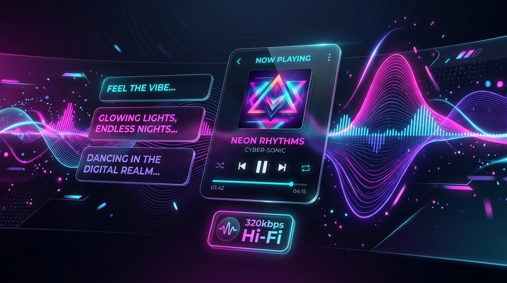

# 🎵 RessoX - Unlimited Music & Synced Lyrics Web App

Official Web Player & Landing Page for **RessoX App** (v2.1.0).

## 🚀 Live Demo & Vercel Deployment

Deploy this repository directly to **Vercel** with zero configuration:

1. Go to [Vercel Dashboard](https://vercel.com/new).
2. Import repository `Prashxonline/RessoX-Web`.
3. Click **Deploy**!

---

## ✨ Features

- 🎧 **Interactive Web Player**: Live 320kbps audio playback, progress seek bar, duration tracking.
- 📜 **Synced Lyrics Engine**: Real-time karaoke-style scrolling lyrics display.
- 🔍 **JioSaavn API Search**: Search & stream over 80 Million songs in real-time.
- 🎨 **Glassmorphism Dark UI**: Built with modern CSS custom properties, neon glowing gradients, and smooth micro-animations.
- ⚡ **Canvas Audio Visualizer**: Dynamic animated audio waveform bars reacting to music playback.
- 📱 **Direct APK Download**: Integrated download CTA cards with SHA-256 checksum verification & installation guide.
- 📱 **100% Mobile Responsive**: Mobile navigation drawer and responsive layout for all screens.

---

## 🛠️ Tech Stack

- **Core**: HTML5, CSS3, JavaScript (ES6+)
- **Audio Engine**: HTML5 Audio API & Web Audio Canvas Visualizer
- **API**: JioSaavn Music REST API (`saavn.dev`)
- **Fonts**: Google Fonts (`Outfit`, `Plus Jakarta Sans`)
- **Deployment**: Vercel Static Hosting

---

## 📄 License & Credits

Developed with ❤️ by **Prashxonline** ([@Prashxonline](https://github.com/Prashxonline)).
